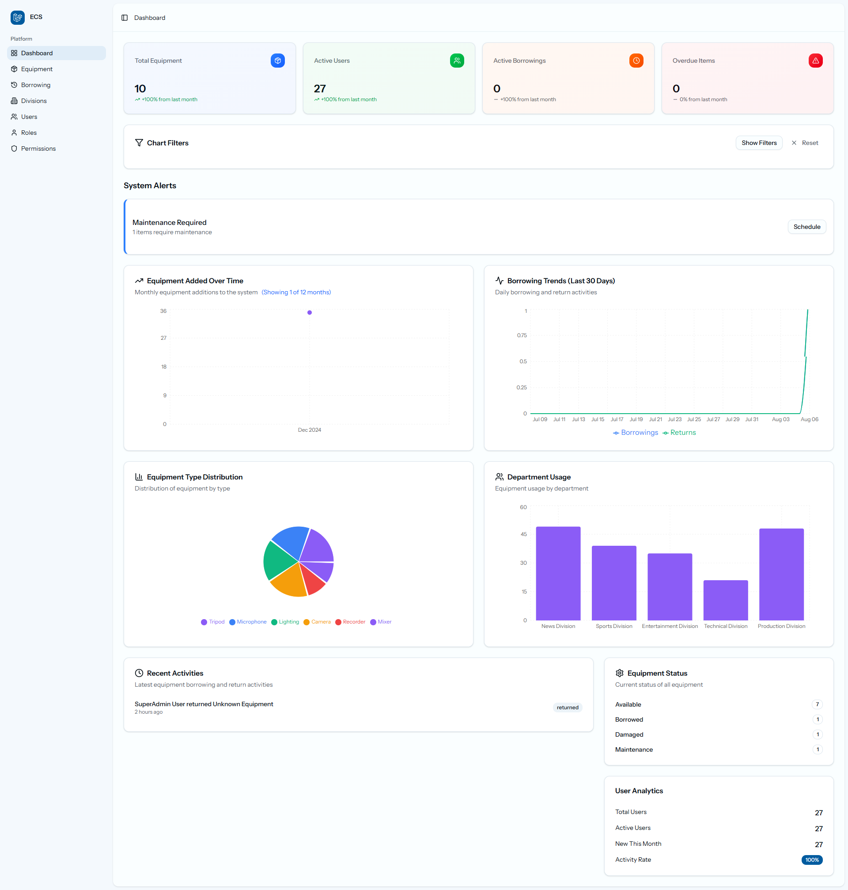

# 📺 Broadcast Equipment Management System

A modern, full-stack web application for managing broadcast equipment inventory, check-in/check-out processes, and user access control. Built with Laravel, React, and TypeScript for professional broadcast organizations.



## ✨ Features

### 📊 **Interactive Dashboard**

- Real-time equipment statistics and analytics
- Dynamic charts showing equipment additions over time
- Borrowing trends and department usage analytics
- Advanced filtering system with date ranges, equipment types, and departments
- System alerts and notifications

### 🎛️ **Equipment Management**

- Complete equipment inventory tracking
- Support for various broadcast equipment types (microphones, mixers, recorders, tripods, etc.)
- Equipment status management: Available, In Use, Maintenance, Damaged
- Equipment history and usage tracking

### 👥 **User & Access Control**

- Multi-level user access with Spatie Laravel Permissions
    - **Admin (Technician)**: Full equipment management
    - **Viewer (Editorial/Production)**: Equipment browsing and borrowing
    - **Superadmin (Management)**: System-wide oversight
- Division-based user organization
- User activity tracking and analytics

### 📋 **Check-In/Check-Out System**

- Streamlined equipment borrowing workflow
- User details logging (name, division, date, purpose)
- Automatic borrowing history recording
- Return tracking and overdue management

### 📈 **Reports & Analytics**

- Equipment usage statistics by department
- User activity and engagement metrics
- Monthly equipment addition trends
- Borrowing patterns and return analytics
- Export capabilities for data analysis

## 🛠️ Tech Stack

### **Backend**

- **Laravel** - PHP framework for robust API development
- **Inertia.js** - Seamless SPA experience without API complexity
- **Spatie Laravel Permissions** - Role-based access control
- **MariaDB** - Reliable database for equipment and user data

### **Frontend**

- **React** - Modern UI library for interactive interfaces
- **TypeScript** - Type safety and enhanced developer experience
- **Inertia React** - Server-driven single page applications
- **Tailwind CSS V5** - Utility-first styling framework

### **UI Components**

- **shadcn/ui** - High-quality, accessible UI components
- **Magic UI** - Advanced animated components for enhanced UX
- **Framer Motion** - Smooth animations and transitions
- **Recharts** - Interactive data visualization charts
- **Lucide React** - Beautiful, customizable icons

## 📁 Project Structure

```
asset-management/
├── app/
│   ├── Http/Controllers/
│   │   ├── DashboardController.php     # Dashboard analytics
│   │   └── WelcomeController.php       # Landing page data
│   ├── Models/
│   │   ├── Equipment.php               # Equipment model
│   │   ├── User.php                    # User model
│   │   ├── Division.php                # Department model
│   │   └── EquipmentUser.php           # Borrowing relationships
│   └── Actions/                        # Business logic actions
├── resources/
│   ├── js/
│   │   ├── components/ui/              # Reusable UI components
│   │   │   ├── charts/                 # Chart components
│   │   │   └── stats-card.tsx          # Statistics display
│   │   ├── pages/
│   │   │   ├── dashboard.tsx           # Main dashboard
│   │   │   └── welcome.tsx             # Landing page
│   │   └── layouts/
│   │       └── app-layout.tsx          # Main application layout
│   └── css/
│       └── app.css                     # Global styles
├── database/
│   ├── migrations/                     # Database schema
│   └── seeders/                        # Sample data
└── docs/
    ├── dashboard-system.md             # Dashboard documentation
    └── dashboard-filters.md            # Filter system guide
```

## 🚀 Quick Start

### Prerequisites

- PHP 8.1 or higher
- Node.js 18+ and npm
- MariaDB/MySQL database
- Composer

### Installation

1. **Clone the repository**

    ```bash
    git clone https://github.com/yourusername/broadcast-equipment-manager.git
    cd broadcast-equipment-manager
    ```

2. **Install PHP dependencies**

    ```bash
    composer install
    ```

3. **Install Node.js dependencies**

    ```bash
    npm install
    ```

4. **Environment setup**

    ```bash
    cp .env.example .env
    php artisan key:generate
    ```

5. **Configure database**

    ```bash
    # Update .env with your database credentials
    DB_CONNECTION=mysql
    DB_HOST=127.0.0.1
    DB_PORT=3306
    DB_DATABASE=equipment_management
    DB_USERNAME=your_username
    DB_PASSWORD=your_password
    ```

6. **Run migrations and seeders**

    ```bash
    php artisan migrate --seed
    ```

7. **Build frontend assets**

    ```bash
    npm run build
    ```

8. **Start the development server**
    ```bash
    php artisan serve
    ```

Visit `http://localhost:8000` to access the application.

## 🔧 Development

### Frontend Development

```bash
# Start Vite development server
npm run dev

# Build for production
npm run build

# Type checking
npm run type-check
```

### Backend Development

```bash
# Start Laravel development server
php artisan serve

# Run database migrations
php artisan migrate

# Refresh database with fresh data
php artisan migrate:fresh --seed

# Clear application cache
php artisan cache:clear
```

### Testing

```bash
# Run PHP tests
php artisan test

# Run frontend tests
npm run test
```

## 📊 Dashboard Features

### **Real-time Analytics**

- Equipment inventory statistics
- User activity metrics
- Borrowing trends over time
- Department usage analytics

### **Advanced Filtering**

- Filter by date ranges (7 days to 1 year)
- Equipment type filtering
- Department-specific views
- Status-based filtering (Available, In Use, Maintenance, Damaged)

### **Interactive Charts**

- Line charts for equipment additions over time
- Borrowing trends with dual-line visualization
- Pie charts for equipment type distribution
- Bar charts for department usage comparison

### **System Monitoring**

- Real-time alerts for overdue equipment
- Maintenance scheduling notifications
- Low stock warnings
- User activity tracking

## 🎯 Use Cases

### **Broadcast Organizations**

- Television stations managing camera, audio, and lighting equipment
- Radio stations tracking microphones, mixers, and recording devices
- Production companies organizing equipment across multiple projects

### **Educational Institutions**

- Broadcasting departments managing student equipment access
- Media labs tracking equipment loans and returns
- Training facilities monitoring equipment usage

### **Corporate Media Departments**

- Internal communications teams managing AV equipment
- Marketing departments tracking video production assets
- Event management teams organizing portable equipment

## 🤝 Contributing

We welcome contributions! Please see our [Contributing Guidelines](CONTRIBUTING.md) for details.

1. Fork the repository
2. Create a feature branch (`git checkout -b feature/amazing-feature`)
3. Commit your changes (`git commit -m 'Add some amazing feature'`)
4. Push to the branch (`git push origin feature/amazing-feature`)
5. Open a Pull Request

## 📝 License

This project is licensed under the MIT License - see the [LICENSE](LICENSE) file for details.

## 👨‍💻 Development Team

- **Backend Development**: Laravel APIs, database design, authentication
- **Frontend Development**: React components, TypeScript interfaces, UI/UX
- **DevOps**: Deployment, CI/CD, server configuration

## 🆘 Support

For support and questions:

- Create an [Issue](https://github.com/yourusername/broadcast-equipment-manager/issues)
- Check our [Documentation](docs/)
- Join our community discussions

## 🔮 Roadmap

### **Phase 1** ✅

- [x] Core equipment management
- [x] User authentication and roles
- [x] Basic dashboard with statistics
- [x] Equipment check-in/check-out system

### **Phase 2** ✅

- [x] Advanced dashboard with charts
- [x] Filtering and search capabilities
- [ ] Real-time analytics
- [ ] System alerts and notifications

### **Phase 3** 🚧

- [ ] Mobile application (React Native)
- [ ] QR code equipment scanning
- [ ] Automated email/WhatsApp notifications
- [ ] Equipment maintenance scheduling
- [ ] Advanced reporting and exports

### **Phase 4** 📋

- [ ] Integration with external inventory systems
- [ ] Equipment depreciation tracking
- [ ] Advanced analytics and AI insights
- [ ] Multi-tenant support for organizations

## 📸 Screenshots

### Dashboard Overview


### Equipment Management


### Analytics & Reports


---

<div align="center">

**Built with ❤️ for broadcast professionals**

[Demo](https://demo.broadcast-equipment-manager.com) • [Documentation](docs/) • [Report Bug](https://github.com/yourusername/broadcast-equipment-manager/issues) • [Request Feature](https://github.com/yourusername/broadcast-equipment-manager/issues)

</div>
